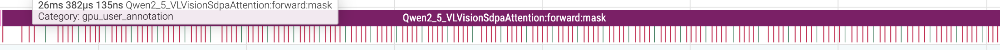
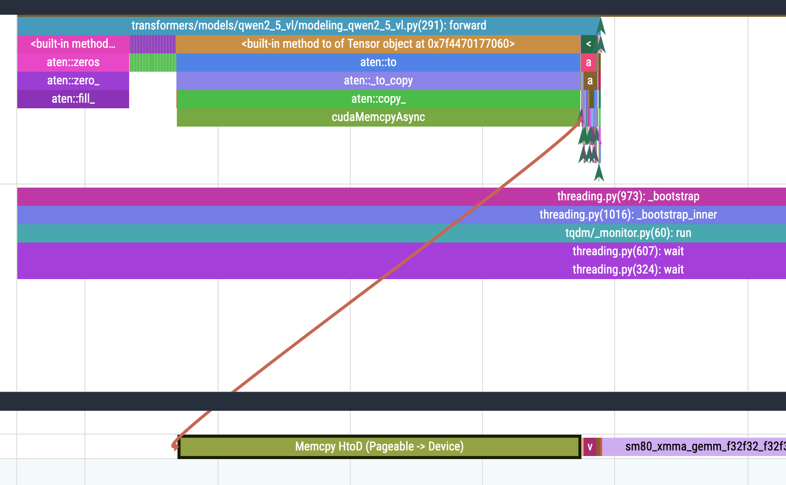

# D2H 问题定位与优化

做了 `torch.compile` 后，想看看 compile 后的效果，于是我打开了 perfetto，看到了这个：

一片密密麻麻的 **Memcpy DtoH** 算子，看到眼前一黑（其实是 **眼前一亮**，又有可以优化的点了）


于是我顺着这条线找它的调用栈，发现这是 transformers forward 里做了 aten::item，这会触发 D2H:

> .item()（或隐式转换如 int(tensor), float(tensor), tensor.tolist() 在 0-d 情况）需要把 GPU 上的数值拷回 CPU 才能得到 Python 原生数,从而导致 Memcpy DtoH。


transformer 源码：transformers/models/qwen2_5_vl/modeling_qwen2_5_vl.py(291):forward

```Python
def forward(
        self,
        hidden_states: torch.Tensor,
        cu_seqlens: torch.Tensor,
        rotary_pos_emb: Optional[torch.Tensor] = None,
        position_embeddings: Optional[Tuple[torch.Tensor, torch.Tensor]] = None,
    ) -> torch.Tensor:
        seq_length = hidden_states.shape[0]
        q, k, v = self.qkv(hidden_states).reshape(seq_length, 3, self.num_heads, -1).permute(1, 0, 2, 3).unbind(0)
        if position_embeddings is None:
            logger.warning_once(
                "The attention layers in this model are transitioning from computing the RoPE embeddings internally "
                "through `rotary_pos_emb` (2D tensor of RoPE theta values), to using externally Pcomputed "
                "`position_embeddings` (Tuple of tensors, containing cos and sin). In v4.54 `rotary_pos_emb` will be "
                "removed and `position_embeddings` will be mandatory."
            )
            emb = torch.cat((rotary_pos_emb, rotary_pos_emb), dim=-1)
            cos = emb.cos().float()
            sin = emb.sin().float()
        else:
            cos, sin = position_embeddings
        q, k = apply_rotary_pos_emb_vision(q, k, cos, sin)

        attention_mask = torch.zeros([1, seq_length, seq_length], device=q.device, dtype=torch.bool)
        for i in range(1, len(cu_seqlens)):
            attention_mask[..., cu_seqlens[i - 1] : cu_seqlens[i], cu_seqlens[i - 1] : cu_seqlens[i]] = True

        q = q.transpose(0, 1)
        k = k.transpose(0, 1)
        v = v.transpose(0, 1)
        attn_output = F.scaled_dot_product_attention(q, k, v, attention_mask, dropout_p=0.0)
        attn_output = attn_output.transpose(0, 1)
        attn_output = attn_output.reshape(seq_length, -1)
        attn_output = self.proj(attn_output)
        return attn_output
```

这里我结合 GPT 和我的个人理解说一下这里会发生大面积 `D2H` 的原因

1. `len(cu_seqlens)` : 如果 `cu_seqlens` 是 GPU Tensor，Python 的 `len()` 会调用:

   ```Python
   __len__() -> aten::size -> aten::_local_scalar_dense
   ```

   这样会触发一次 `D2H` 拷贝，把 GPU 上的 tensor 取回 CPU

2. `cu_seqlens[i]` : 这里的 `cu_seqlens` 是 **CUDA Tensor**，而 Python 切片 [a:b] 期望的是 **CPU int**。这会触发以下调用链:

   ```Python
   cu_seqlens[i - 1] : cu_seqlens[i]

   aten::item (Tensor.item)
       -> aten::_local_scalar_dense
       -> cudaMemcpyAsync (GPU -> CPU)
       -> Memcpy DtoH (Device -> Pinned)
   ```

   而且这个过程在 forward 中是循环多次执行的:

   ```Python
   attention_mask = torch.zeros([1, seq_length, seq_length], device=q.device, dtype=torch.bool)
       for i in range(1, len(cu_seqlens)):
           attention_mask[..., cu_seqlens[i - 1] : cu_seqlens[i], cu_seqlens[i - 1] : cu_seqlens[i]] = True
   ```

有了初步判断，我通过 `record_function` 验证上述猜想

```Python
from torch.profiler import record_function

with record_function("Qwen2_5_VLVisionSdpaAttention:forward:mask"):
    attention_mask = torch.zeros([1, seq_length, seq_length], device=q.device, dtype=torch.bool)
       for i in range(1, len(cu_seqlens)):
           attention_mask[..., cu_seqlens[i - 1] : cu_seqlens[i], cu_seqlens[i - 1] : cu_seqlens[i]] = True
```

结果不失所望，大面积 `D2H` 确实是这一块代码导致的



那理论上来说，我可以在 CPU 上直接把 `attention_mask` 计算完再 `.to(device)`，可以减少反复多次的 `D2H`。

```Python
cu_seqlens_cpu = cu_seqlens.cpu().tolist()

attention_mask_cpu = torch.zeros([1, seq_length, seq_length], dtype=torch.bool)
for i in range (1, len(cu_seqlens_cpu)):
    attention_mask_cpu[..., cu_seqlens_cpu[i - 1] : cu_seqlens_cpu[i], cu_seqlens_cpu[i - 1] : cu_seqlens_cpu[i]] = True

attention_mask = attention_mask_cpu.to(q.device)
```

跑出来的 profile 是多么的好看，原本密密麻麻的 `H2D` 现在整合成了一块大 `H2D`



在我满心欢喜，觉得这直接拿下的时候，结果让我傻眼了！？

```bash
No torch compile
batch_infer time: 9.930200099945068

D2H 修改前
batch_infer time: 8.901242733001709

D2H 修改后
batch_infer time: 9.848342657089233
```

不是，这怎么都要赶上 `No torch compile` 了，慢这么多？ 看来 transformers 真是藏了一手，应该是权衡过纯 CPU 计算 `attention_mask` 和 GPU 少量多次 D2H 计算 `attention_mask` 的损耗。

虽然原本频繁地 D2H 会造成一定的开销，**但大 seq_len / batch，CPU 上创建大矩阵 + 拷贝到 GPU 的成本远比小块 D2H 总和还要高**。

所以我打算 `attention_mask` 还是在 GPU 上计算，因为 GPU 矩阵计算快且避免 CPU -> GPU 通信开销，而 CPU 用来读取数据量并不大的 `cu_seqlens`。

```Python
cu_seqlens_cpu = cu_seqlens.cpu().tolist()

attention_mask = torch.zeros([1, seq_length, seq_length], device=q.device, dtype=torch.bool)
for start, end in zip(cu_seqlens_cpu, cu_seqlens_cpu[1:]):
    attention_mask[..., start:end, start:end] = True
```

这次结果不失所望，而且从 profile 图像来看，原本 繁琐/整片 的 `D2H` 没了，取而代之的是 GPU 上的 `aten::fill_`。


从执行耗时来看，提升也是很明显的。

```bash
No torch compile
batch_infer time: 9.930200099945068

D2H 修改前
batch_infer time: 8.901242733001709

D2H 修改后（第一次）
batch_infer time: 9.848342657089233

D2H 修改后（第二次）
batch_infer time: 8.560559511184692
```

不过再看图像，会发现还有一大片绿色的块，其实是我代码中 `attention_mask[..., start:end, start:end] = True` 这一行的底层实现。

这个还能不能优化呢？GPT 老师推荐是通过 FlashAttention 进行优化。

```C++
void at::native::elementwise_kernel<128, 4, at::native::gpu_kernel_impl_nocast<at::native::FillFunctor<bool> >(at::TensorIteratorBase&, at::native::FillFunctor<bool> const&)::{lambda(int)#1}>(int, at::native::gpu_kernel_impl_nocast<at::native::FillFunctor<bool> >(at::TensorIteratorBase&, at::native::FillFunctor<bool> const&)::{lambda(int)#1})
```
